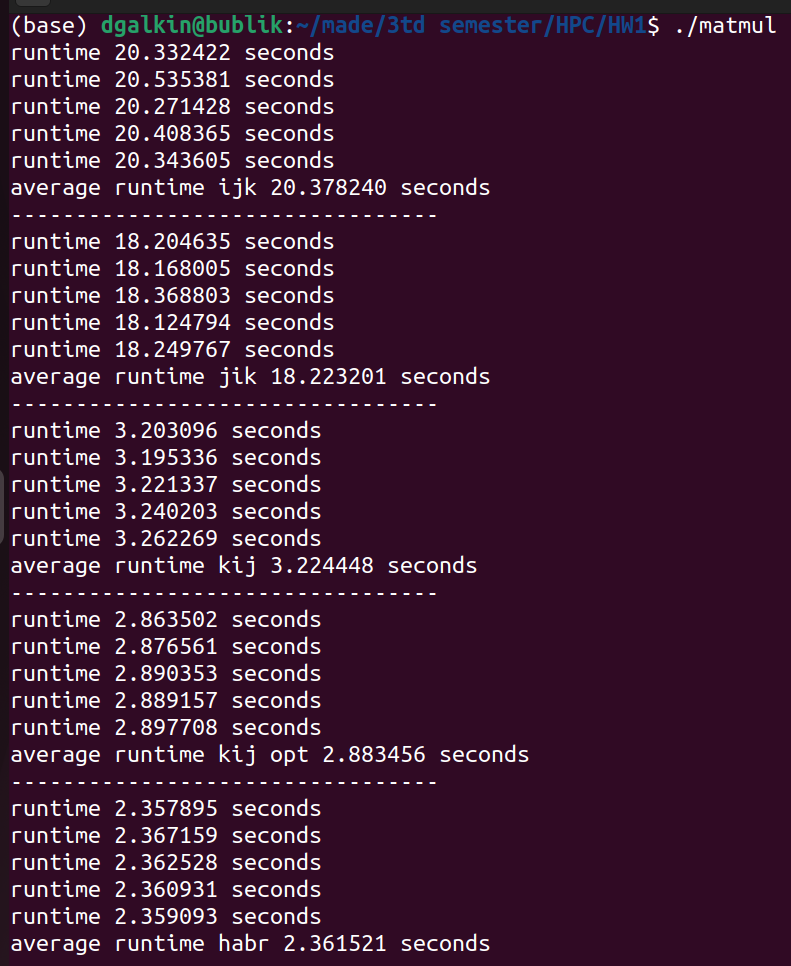

# Homework #1

1. Первые два задания, связанные с рейтингом top500 суперкомпьтеров, приведены в ноутбуке `HW1_HPC.ipynb`.

2. Третье задание, связанное с перемножением матриц - в файле `matmul.c`. Идею ускорения вычисления матриц взял из этой статьи https://habr.com/en/post/114797/ (метод назвал `CalcMatMulTime_habr`). Ускорить удалось на 18% относительно метода `CalcMatMulTime_kij_opt`. Скрин ниже.

